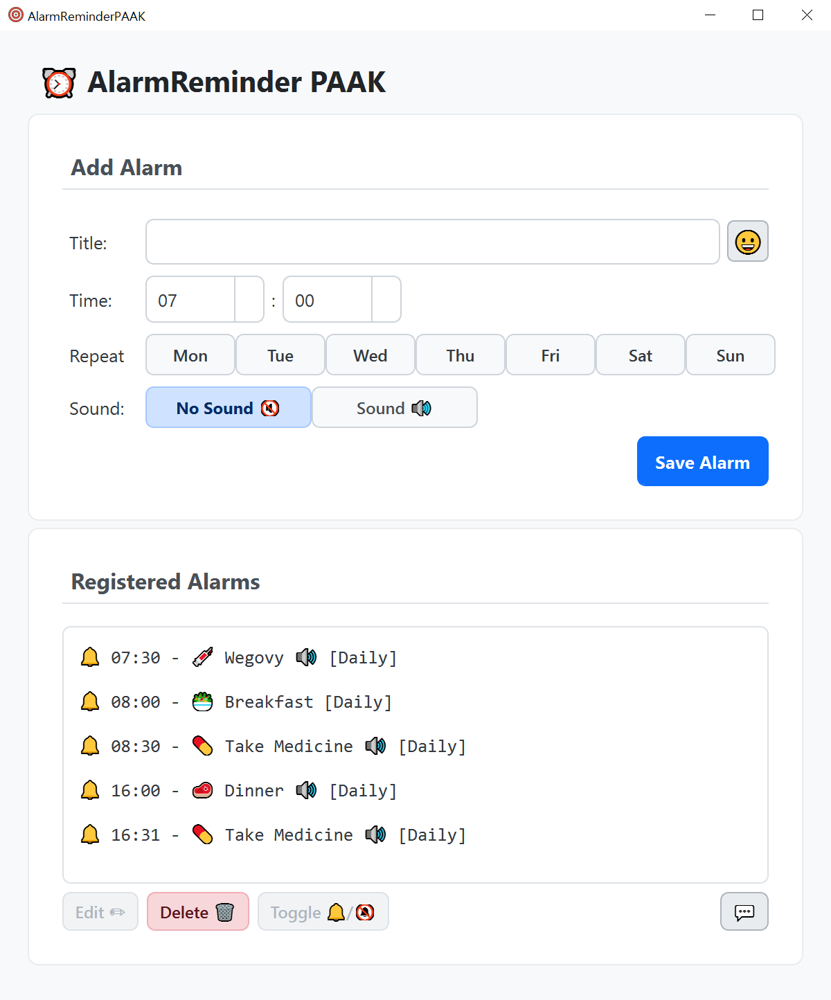
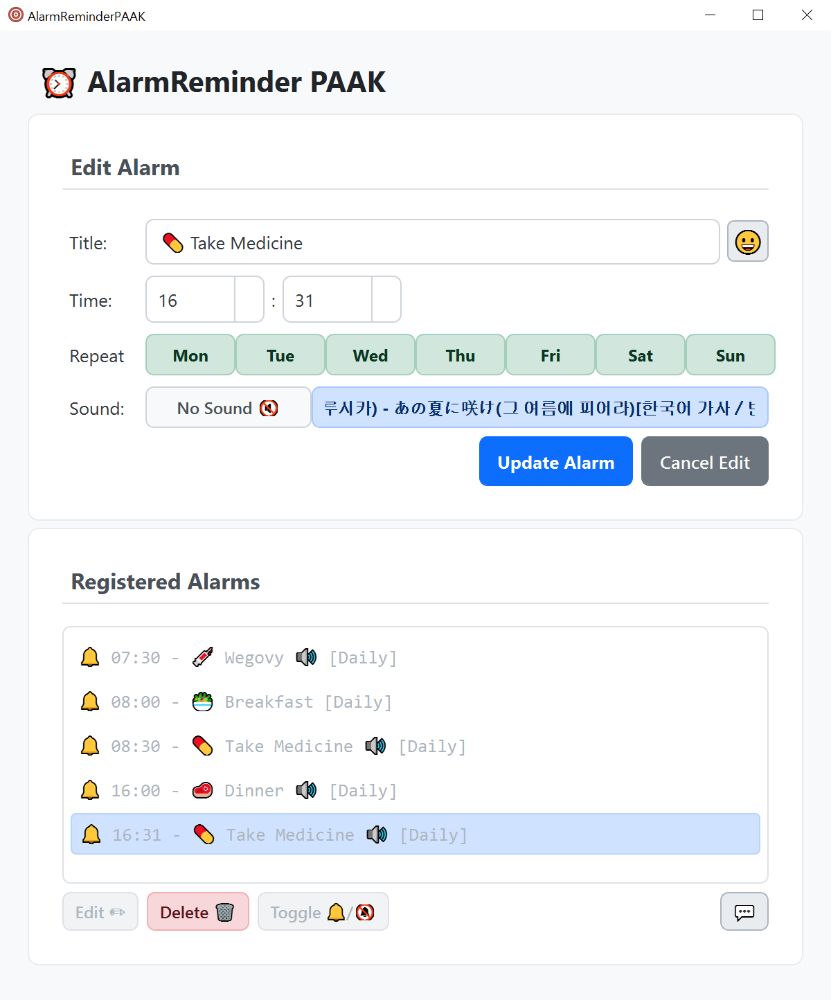

# AlarmReminderApp ⏰🔔

A simple and easy-to-use desktop alarm and reminder application. Get notified at specified times and play desired sounds in a Windows environment. 😄

## Quick Links 🔗

- [⬇️ Download Latest Release](https://github.com/htpaak/AlarmReminderApp/releases/latest)
- [⭐ GitHub Repository](https://github.com/htpaak/AlarmReminderApp)
- [💬 Feedback & Discussions](https://github.com/htpaak/AlarmReminderApp/discussions)

## Key Features 🌟

*   **Alarm Management:** Easily add, edit, and delete alarms.
*   **Time & Repetition Settings:** Freely set desired times and repetition days (daily, weekdays, weekends, specific days).
*   **Custom Sounds:** Set a desired `.wav` or `.mp3` sound file for each alarm or set it to silent.
*   **Enable/Disable:** Temporarily turn specific alarms on or off.
*   **System Tray:** Minimize the app to the system tray to run in the background without closing it.
*   **Desktop Notifications:** A Windows desktop notification appears at the set time along with the configured sound playback.
*   **Data Persistence:** The list of configured alarms is securely saved in the `alarms.json` file.
*   **Logging:** Detailed logs about the application's operation are recorded in the `logs` folder.

## Demo 📸

## System Requirements 💻

- Windows 7/8/10/11 (64-bit recommended)
- ~100MB of free disk space 💾
- Basic computer specs for smooth media playback

## Installation 🚀

1.  Download the latest executable file (`AlarmReminderApp_vX.Y.Z.exe`) from the [Releases Page](https://github.com/htpaak/AlarmReminderApp/releases/latest).
2.  Run the downloaded `.exe` file. No separate installation process is required.
3.  Launch AlarmReminderApp and start setting up your alarms! 🎉

## How to Use 📖

1.  **Adding an Alarm:**
    *   In the `Add Alarm` section, set the title, time, and repetition days.
    *   Click the `Sound` button to select a `.wav` or `.mp3` file to use as the alarm sound, or press the `No Sound` button to set it to silent.
    *   Click the `Save Alarm` button to save the alarm.
2.  **Editing an Alarm:**
    *   Select the alarm to edit from the `Registered Alarms` list.
    *   Click the `Edit` button.
    *   Modify the desired details in the `Edit Alarm` section and click the `Update Alarm` button.
    *   To cancel editing, click the `Cancel Edit` button.
3.  **Deleting an Alarm:**
    *   Select the alarm to delete from the `Registered Alarms` list.
    *   Click the `Delete` button and select `Yes` in the confirmation message.
4.  **Enabling/Disabling an Alarm:**
    *   Select the alarm whose status you want to change in the `Registered Alarms` list or double-click it.
    *   Click the `Toggle` button or double-click the alarm item to switch between enabled (🔔) and disabled (🔕) states. Disabled alarms are displayed in gray.
5.  **System Tray:**
    *   Clicking the close (X) button in the top-right corner of the window minimizes the app to the system tray instead of closing it.
    *   Right-click the tray icon to show the window again using the `Show/Hide` menu or completely exit the app using the `Quit` menu.
    *   Left-clicking the tray icon also shows or hides the window.

## Usage 🧭

*   **Daily Reminders:** Set reminders for taking medication, important appointments, break times, etc., so you don't forget.
*   **Task Notifications:** Get notified about tasks that need to start at a specific time or deadlines.
*   **Wake-up Alarm:** Use it as a morning wake-up alarm with your preferred sound.

## Development Information 👨‍💻

*   **Language:** Python 3
*   **GUI Library:** PyQt5
*   **Scheduling:** schedule library
*   **Notifications:** Windows API (ctypes, winrt - see `notification.py`)
*   **Data Storage:** JSON (`storage.py`)
*   **Logging:** logging module (`log_setup.py`, `main.py`)

## Acknowledgments 🙏

*   Thanks to all the potential contributors who might help with development in the future! 💖
*   Special thanks to the amazing open-source libraries that make this project possible! FOSS rocks! 🤘
